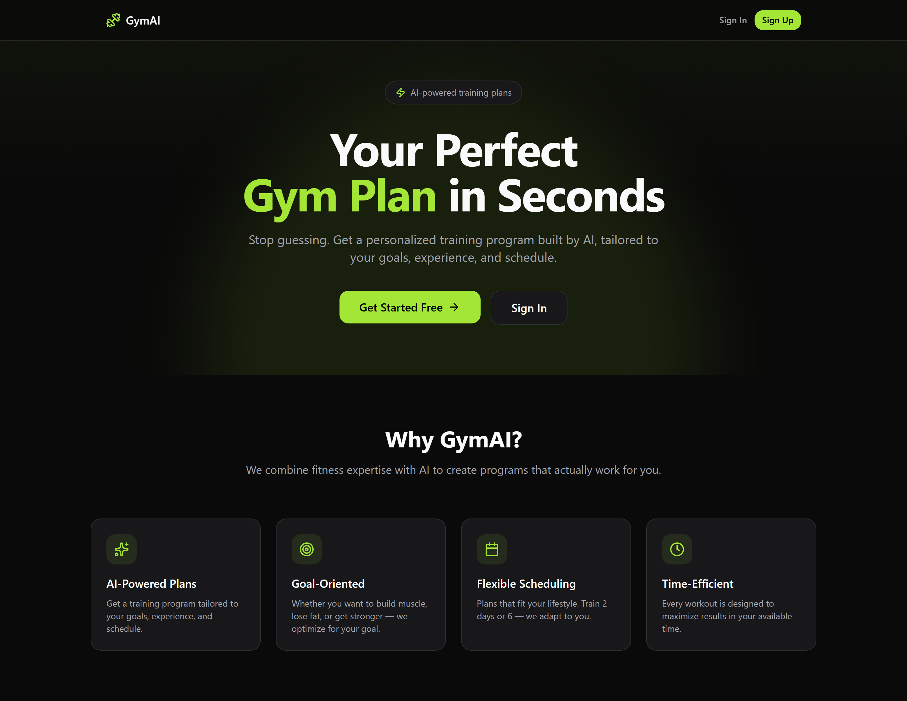

<div align="center">

# 🏋️ GymAI — AI-Powered Personal Training Planner

**Generate personalized, science-based workout programs tailored to your goals, experience, equipment, and schedule — powered by Google Gemini.**

### 🔗 [**Live Demo →**](https://llmintegratedgymapp.vercel.com)

[](https://llmintegratedgymapp.vercel.com)
[](https://react.dev/)
[](https://www.typescriptlang.org/)
[](https://vite.dev/)
[](https://tailwindcss.com/)
[](https://expressjs.com/)
[](https://www.prisma.io/)
[](https://neon.tech/)
[](https://ai.google.dev/)

</div>

---

## 📖 Overview

GymAI is a full-stack **PERN-style** application (PostgreSQL · Express · React · Node) that uses a large language model to design complete weekly training programs. Users sign up, complete a short fitness onboarding, and instantly receive a structured, progressive workout plan — including per-exercise sets, reps, rest, RPE targets, alternatives, and a progression strategy.

---

## 📸 Screenshots

> Add your images to `docs/screenshots/` and they'll render here.

| Landing | Onboarding | Generated Plan |
|:---:|:---:|:---:|
|  |  |  |

---

## ✨ Features

- 🤖 **AI-generated training plans** — personalized via Google Gemini (`gemini-2.5-flash`)
- 🎯 **Goal-oriented programming** — bulk, cut, recomp, strength, or endurance
- 📅 **Flexible scheduling** — 2–6 training days per week, 30–90 min sessions
- 🏋️ **Equipment-aware** — full gym, home gym, or dumbbells-only
- 🩹 **Injury-aware** — avoids movements that aggravate user-reported limitations
- 🔀 **Multiple split styles** — full body, upper/lower, push/pull/legs, or custom
- 📈 **Structured output** — sets, reps, rest, RPE, form notes, and exercise alternatives
- 🗂️ **Plan versioning** — each regeneration is stored as a new version
- 🔐 **Authentication** — sign up / sign in via **Neon Auth**
- 🛡️ **Resilient by design** — automatic retries for transient database and AI failures, with model fallback

---

## 🛠️ Tech Stack

### Frontend
| Technology | Purpose |
|---|---|
| **React 19** | UI library |
| **TypeScript** | Type safety |
| **Vite 7** | Build tool & dev server |
| **Tailwind CSS 4** | Styling (via `@tailwindcss/vite`) |
| **React Router 7** | Client-side routing |
| **Neon Auth** (`@neondatabase/neon-js`) | Authentication & user management |
| **lucide-react** | Icon set |

### Backend
| Technology | Purpose |
|---|---|
| **Node.js + Express 5** | REST API server |
| **TypeScript** (`tsx`) | Type-safe runtime with watch mode |
| **Prisma 7** | ORM & migrations |
| **`@prisma/adapter-pg`** | PostgreSQL driver adapter |
| **PostgreSQL (Neon)** | Serverless Postgres database |
| **OpenAI SDK** | Client for Gemini's OpenAI-compatible endpoint |
| **Google Gemini** | LLM for plan generation |
| **dotenv · cors · cookie-parser** | Config & middleware |

---

## 🗂️ Project Structure

```
pern-fullstack-course/
├── src/                          # Frontend (React + Vite)
│   ├── components/               # UI, layout & plan components
│   ├── context/AuthContext.tsx   # Auth + data-fetching state
│   ├── lib/                      # api client & auth client
│   ├── pages/                    # Home, Auth, Onboarding, Profile, Account
│   └── types/                    # Shared TypeScript types
├── server/                       # Backend (Express + Prisma)
│   ├── prisma/                   # Schema & migrations
│   ├── src/
│   │   ├── lib/ai.ts             # Gemini plan generation (+ retry/fallback)
│   │   ├── lib/prisma.ts         # Prisma client (+ connection retry)
│   │   ├── routes/               # profile & plan routes
│   │   └── index.ts              # Express entry point
│   └── types/                    # Backend TypeScript types
├── docs/screenshots/             # README images
└── README.md
```

---

## 🚀 Getting Started

### Prerequisites
- **Node.js** 18+ and npm
- A **[Neon](https://neon.tech/)** account (free) — for the PostgreSQL database & Auth
- A **[Google AI Studio](https://aistudio.google.com/)** API key (free) — for Gemini

### 1. Clone the repository
```bash
git clone https://github.com/machadop1407/pern-fullstack-course.git
cd pern-fullstack-course
```

### 2. Install dependencies
```bash
# Frontend (root)
npm install

# Backend
cd server
npm install
npx prisma generate
cd ..
```

### 3. Configure environment variables
Create the two `.env` files described in [Environment Variables](#-environment-variables) below.

### 4. Set up the database
```bash
cd server
npx prisma migrate deploy   # applies existing migrations to your Neon database
cd ..
```

### 5. Run the app (two terminals)
```bash
# Terminal 1 — Backend  (from the server/ folder)
cd server
npm run dev:server          # http://localhost:3001

# Terminal 2 — Frontend (from the project root)
npm run dev                 # http://localhost:5173
```

Open **http://localhost:5173** in your browser. 🎉

---

## 🔑 Environment Variables

### Backend — `server/.env`
| Variable | Required | Description |
|---|:---:|---|
| `DATABASE_URL` | ✅ | Neon/PostgreSQL connection string |
| `GEMINI_API_KEY` | ✅ | Google AI Studio API key (`AIza…`) |
| `PORT` | ➖ | Server port (default `3001`) |
| `BASE_URL` | ➖ | Public server URL (default `http://localhost:3001`) |

```env
DATABASE_URL=postgresql://<user>:<password>@<host>/<db>?sslmode=require
GEMINI_API_KEY=AIza...
PORT=3001
BASE_URL=http://localhost:3001
```

### Frontend — `.env` (project root)
| Variable | Required | Description |
|---|:---:|---|
| `VITE_NEON_AUTH_URL` | ✅ | Neon Auth client URL |
| `VITE_API_URL` | ➖ | Backend API base URL (default `http://localhost:3001`) |

```env
VITE_NEON_AUTH_URL=https://...
VITE_API_URL=http://localhost:3001
```

> ⚠️ Both `.env` files are git-ignored. Never commit your real keys.

---

## 📡 API Reference

Base URL: `http://localhost:3001/api`

| Method | Endpoint | Description |
|---|---|---|
| `POST` | `/profile` | Create or update a user's fitness profile |
| `POST` | `/plan/generate` | Generate a new AI training plan for a user |
| `GET`  | `/plan/current?userId=<id>` | Fetch a user's most recent plan |

**Example — generate a plan**
```bash
curl -X POST http://localhost:3001/api/plan/generate \
  -H "Content-Type: application/json" \
  -d '{ "userId": "<user-uuid>" }'
```

---

## 🗄️ Database Schema

**`user_profiles`** — one row per user
| Column | Type | Notes |
|---|---|---|
| `user_id` | `uuid` | Primary key |
| `goal` | `varchar(20)` | bulk / cut / recomp / strength / endurance |
| `experience` | `varchar(20)` | beginner / intermediate / advanced |
| `days_per_week` | `int` | |
| `session_length` | `int` | minutes |
| `equipment` | `varchar(20)` | full_gym / home / dumbbells |
| `injuries` | `text?` | optional |
| `preferred_split` | `varchar(20)` | full_body / upper_lower / ppl / custom |
| `updated_at` | `timestamptz` | |

**`training_plans`** — one row per generated plan version
| Column | Type | Notes |
|---|---|---|
| `id` | `uuid` | Primary key |
| `user_id` | `uuid` | Indexed |
| `plan_json` | `json` | Structured plan |
| `plan_text` | `text` | Serialized plan |
| `version` | `int` | Auto-incremented per user |
| `created_at` | `timestamptz` | |

---

## 🧠 How AI Generation Works

1. The user's profile is normalized and turned into a detailed, constraint-rich prompt (`server/src/lib/ai.ts`).
2. The request is sent to **Google Gemini** through its **OpenAI-compatible endpoint**, so the standard OpenAI SDK is reused with `baseURL` pointed at Gemini.
3. Gemini returns **strict JSON**, which is validated and shaped into the app's `TrainingPlan` structure with sensible fallbacks.
4. The plan is persisted to PostgreSQL with an incremented version number.

### Resilience
- **AI calls** retry transient errors (`429`, `5xx`) with backoff and **fall back across models**: `gemini-2.5-flash → gemini-flash-latest → gemini-2.0-flash`.
- **Database calls** transparently retry transient connection failures (`P1001` / DNS hiccups) via a Prisma client extension, with IPv4-first resolution.

---

## 📜 Available Scripts

### Frontend (root)
| Script | Description |
|---|---|
| `npm run dev` | Start Vite dev server |
| `npm run build` | Type-check & build for production |
| `npm run preview` | Preview the production build |
| `npm run lint` | Run ESLint |

### Backend (`server/`)
| Script | Description |
|---|---|
| `npm run dev:server` | Start the API with `tsx watch` |

---

## 🗺️ Roadmap

- [ ] Plan history & version comparison UI
- [ ] Editable / regenerate-per-day plans
- [ ] Export plan to PDF
- [ ] Exercise demo media & progress logging

---

## 🙌 Acknowledgements

- [Neon](https://neon.tech/) — serverless Postgres & Auth
- [Google Gemini](https://ai.google.dev/) — plan generation
- [Prisma](https://www.prisma.io/), [Vite](https://vite.dev/), [Tailwind CSS](https://tailwindcss.com/), [lucide](https://lucide.dev/)

---

<div align="center">
Built with 💪 and TypeScript.
</div>
